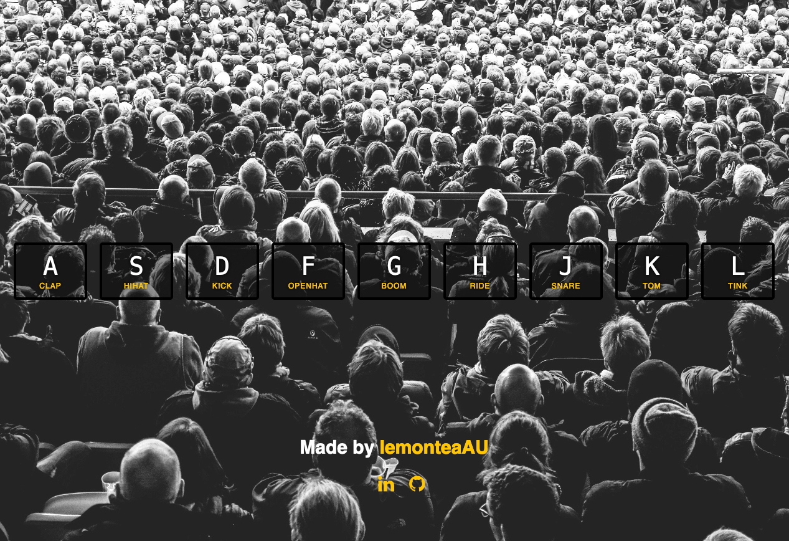

# JavaScript Drum Kit

This is a JavaScript Drum Kit web application allowing users to play drum sounds using their keyboard. 

## Description

This project is part of my journey to learn JavaScript. It demonstrates the use of event listeners, audio playback, and basic animation in a web application.

## Getting Started

To get started with this project, clone the repository and open `index.html` in a web browser.

### Executing program

- Open `index.html` in your browser.
- Press the corresponding keyboard keys to play the drum sounds.

## Acknowledgments

- This project was inspired by [JavaScript30](https://javascript30.com/) course.
